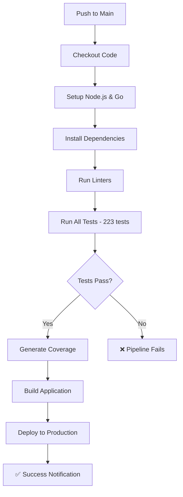

# 🚀 CI/CD Configuration - TP 06 Pruebas Unitarias

Este proyecto está configurado para ejecutar automáticamente **223 tests** en cada push y desplegar la aplicación si todos pasan.

## 📊 Tests Incluidos

- **Backend**: 92 tests (controladores + servicios)
- **Frontend**: 94 tests (utilidades axios)
- **Create Course**: 37 tests (botón crear curso)
- **Total**: 223 tests ✅

## 🔧 Configuración Disponible

### 1. Azure DevOps (Recomendado)

**Archivo**: `azure-pipelines-simple.yml`

**Cómo configurar**:

1. Ve a tu proyecto en Azure DevOps
2. Clic en "Pipelines" → "New Pipeline"
3. Selecciona tu repositorio
4. Copia el contenido de `azure-pipelines-simple.yml`
5. Guarda y ejecuta

**Características**:

- ✅ Ejecuta automáticamente en cada push
- ✅ Instala dependencias con `make install`
- ✅ Ejecuta todos los tests con `make test`
- ✅ Genera reporte de cobertura
- ✅ Build de la aplicación
- ✅ Notificaciones de éxito/error

### 2. GitHub Actions

**Archivo**: `.github/workflows/ci-cd.yml`

**Cómo configurar**:

1. Sube tu código a GitHub
2. Ve a "Actions" en tu repositorio
3. El pipeline se configura automáticamente
4. Se ejecuta en cada push a `main` o `develop`

**Características**:

- ✅ Mismo comportamiento que Azure DevOps
- ✅ Integración nativa con GitHub
- ✅ Artefactos y logs automáticos

## 🎯 Pipeline Flow



## 🧪 Comandos de Testing

### Ejecutar todos los tests:

```bash
make test
```

### Ejecutar tests específicos:

```bash
make test-backend      # 92 tests
make test-frontend     # 94 tests
make test-create-course # 37 tests
```

### Con cobertura:

```bash
make test-coverage
```

## 📈 Monitoreo

### Azure DevOps:

- Ve a "Pipelines" → "Runs" para ver el historial
- Cada ejecución muestra:
  - ✅ Tests pasando/fallando
  - 📊 Reporte de cobertura
  - 🏗️ Build status
  - 📝 Logs detallados

### GitHub Actions:

- Ve a "Actions" en tu repositorio
- Cada workflow run muestra:
  - ✅ Status de cada job
  - 📊 Artefactos generados
  - 📝 Logs de cada paso

## 🔔 Notificaciones

El pipeline envía notificaciones cuando:

- ✅ **Éxito**: Todos los 223 tests pasan
- ❌ **Error**: Algún test falla
- 🚀 **Deploy**: Aplicación desplegada

## 🛠️ Troubleshooting

### Si los tests fallan:

1. Revisa los logs del pipeline
2. Ejecuta localmente: `make test`
3. Verifica que todas las dependencias estén instaladas

### Si el build falla:

1. Verifica que Node.js y Go estén configurados
2. Ejecuta localmente: `make install`
3. Revisa los logs de build

### Si el deploy falla:

1. Verifica las credenciales de despliegue
2. Revisa la configuración del ambiente
3. Ejecuta health checks

## 📋 Checklist de Configuración

- [ ] Pipeline configurado en Azure DevOps o GitHub
- [ ] Variables de ambiente configuradas
- [ ] Credenciales de despliegue configuradas
- [ ] Tests ejecutándose correctamente (223 tests)
- [ ] Notificaciones funcionando
- [ ] Deploy automático funcionando

## 🎉 Resultado Final

Con esta configuración tendrás:

- ✅ **223 tests** ejecutándose automáticamente
- ✅ **Calidad de código** garantizada
- ✅ **Despliegue automático** cuando los tests pasan
- ✅ **Notificaciones** de éxito/error
- ✅ **Reportes de cobertura** automáticos
- ✅ **Historial completo** de builds y deploys

¡Tu aplicación estará siempre actualizada y funcionando! 🚀
